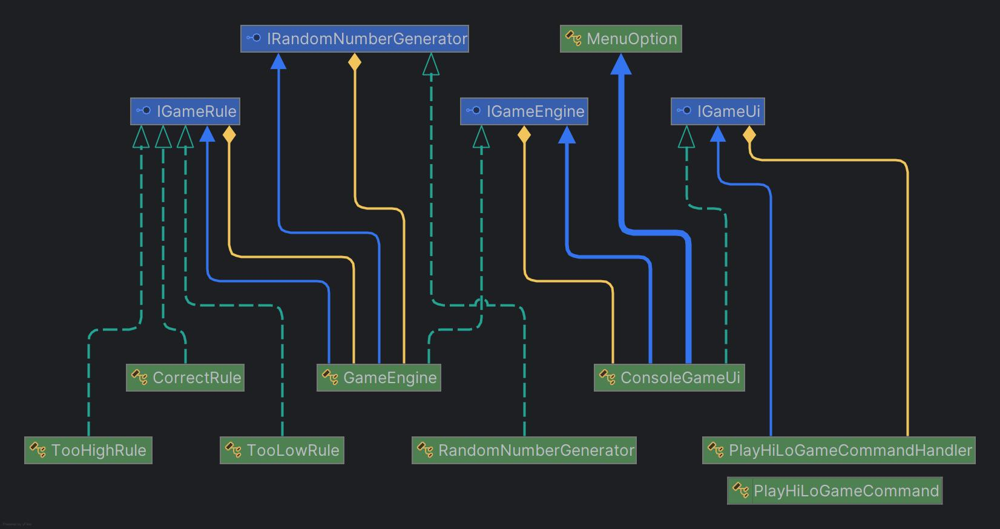

# HiLoGame
## Examples of usage

### To start a game:
Run solution & run the project or build the project & find the .exe file.
You will see a menu like this:

Enjoy the game! :)

Class diagram presents like this:

